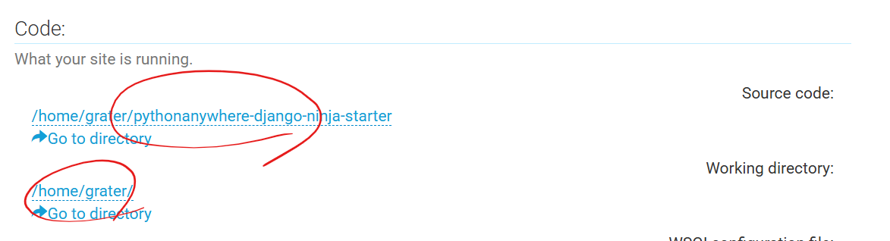

# start

## 로컬 
### 1. 로컬에 파일 복사
```bash
    git clone https://github.com/bamjun/pythonanywhere-django-ninja-starter.git
```

### 2. .env 파일생성
```bash
    bash starter.sh
```

### 3. 가상환경 생성
```bash
uv sync --all-groups
```

## pythonanywhere
### 1. 콘솔접속


### 2. 파일 복사 && 가상환경 생성
```bash
git clone https://github.com/bamjun/pythonanywhere-django-ninja-starter.git
cd pythonanywhere-django-ninja-starter/
uv sync
```

### 3. .env파일 생성
```bash
    bash starter.sh
```

### 4. .env 파일수정
 - CHECK_DEV_MODE=False
 - CHECK_LOCAL_MODE=False
 - ALLOWED_HOSTS= `pythonanywere-URL`

```bash
nano .env
```

### 5. wsgi.py 수정
- 현재 경로 복사해서 wsgi.py 파일 project_home에 붙여넣기
```bash
pwd
```


```python
# This file contains the WSGI configuration required to serve up your
# web application at http://grater.pythonanywhere.com/
# It works by setting the variable 'application' to a WSGI handler of some
# description.
#
# The below has been auto-generated for your Django project

import os
import sys

# add your project directory to the sys.path
project_home = '/home/grater/pythonanywhere-django-ninja-starter'
if project_home not in sys.path:
    sys.path.insert(0, project_home)

# set environment variable to tell django where your settings.py is
os.environ['DJANGO_SETTINGS_MODULE'] = '_core.settings'


# serve django via WSGI
from django.core.wsgi import get_wsgi_application
application = get_wsgi_application()
```

### 6. Source code , Working directory 수정하기
- Source code : 5. 에서 복사한 현재경로
- Working directory : 5. 에서 복사한 현재경로에서 최하위 경로 삭제 


### 7. 파이썬 버전, 가상환경 경로 설정


### 8. 적용하기 


# 로컬 환경설정

### 서버 실행
```bash
uv run python manage.py runserver
```

### ruff check, format & mypy 실행
```bash
bash linter.sh
```


### 테스트 코드 실행
```bash
uv run pytest
```

# pythonanywhere 환경설정

### 파일가져오기
```bash
git pull
uv sync
```

### 적용하기
웹 > 리로드클릭


